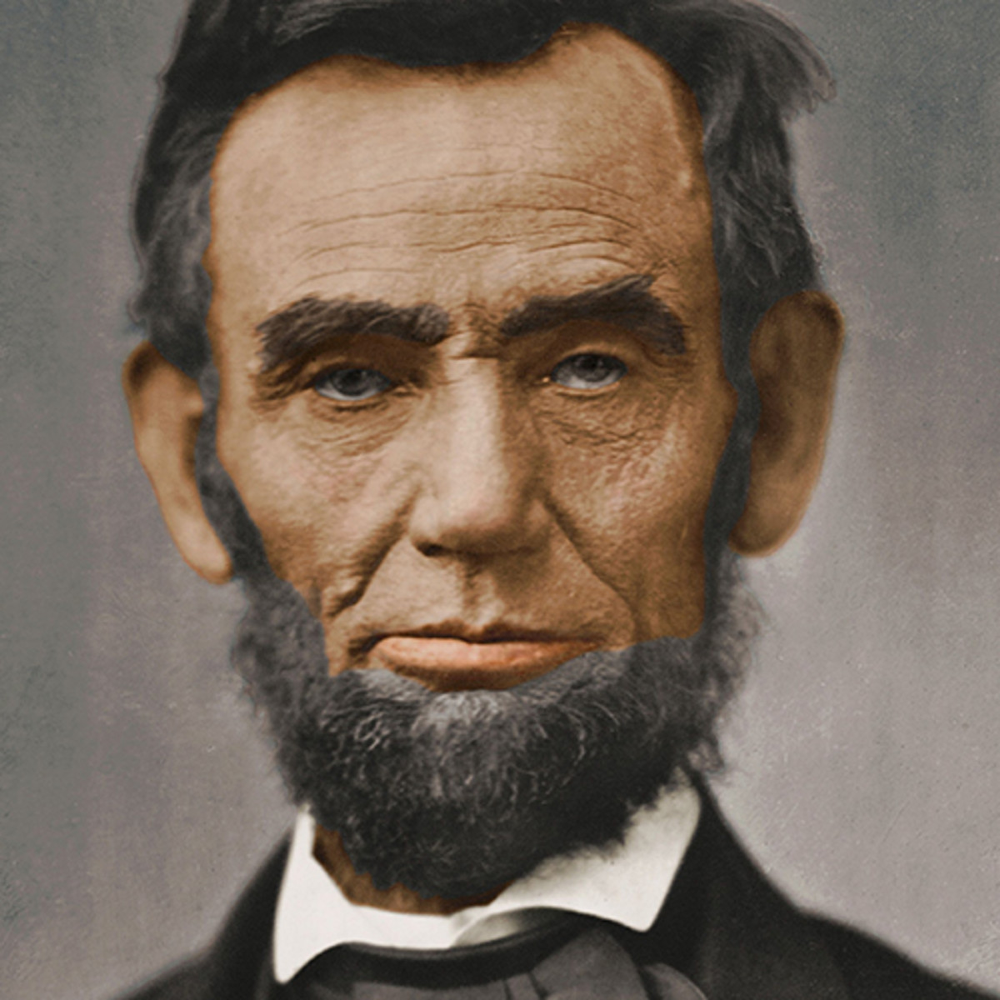
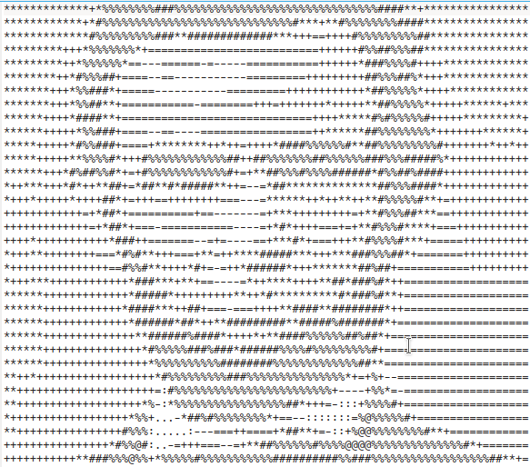

# image_to_Ascii_art
## ASCII Art
ASCII art is a graphic design technique that uses computers for presentation and consists of pictures pieced together from the 95 printable characters defined by the ASCII Standard from 1963 and ASCII compliant character sets with proprietary extended characters

# Requirements
+ Python3
+ Python3-pillow
+ Numpy

# How to Run
1. In Simple way
	`sayan@ubuntu-$: python3 script.py --file <inputfile> --out <outputfile>`
	If you dont provide output file name then by default it will be saved in out.txt

2. Now Simple Open the text file with a text Editor and Take a screenshot

# Heres a Demo

`sayan@sayan-Vostro-15-3568  ~/github/image_to_Ascii_art   master ●  python3 script.py --file lincon.jpg --out lincon.txt 
generating ASCII art...
input image dims: 1200 x 1200
cols: 80, rows: 34
tile dims: 15 x 34
ASCII art written to lincon.txt`

+ Original Image 

+ After Running the Code:

For more Project visit my portfolio [visit](https://royninja.github.io)
